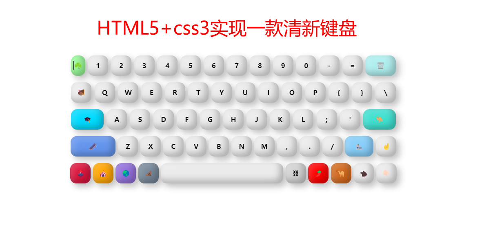
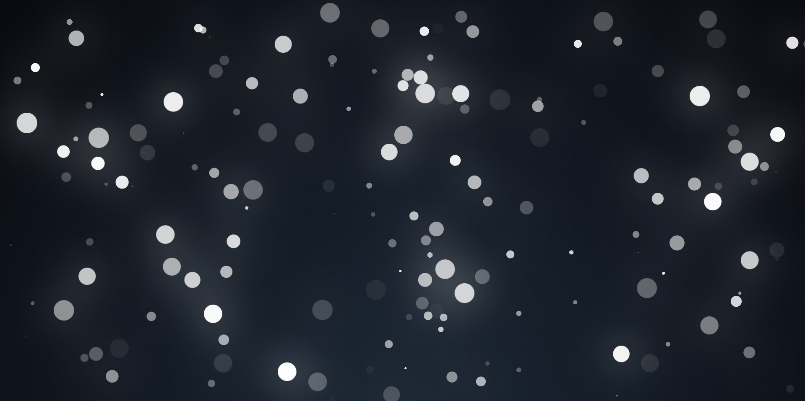
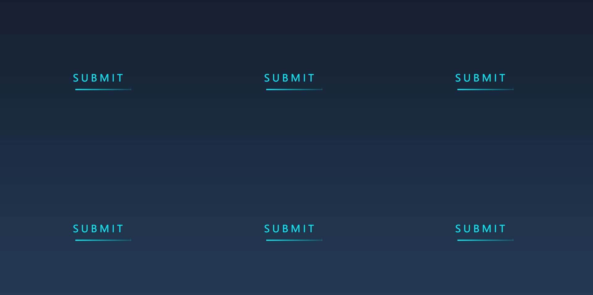
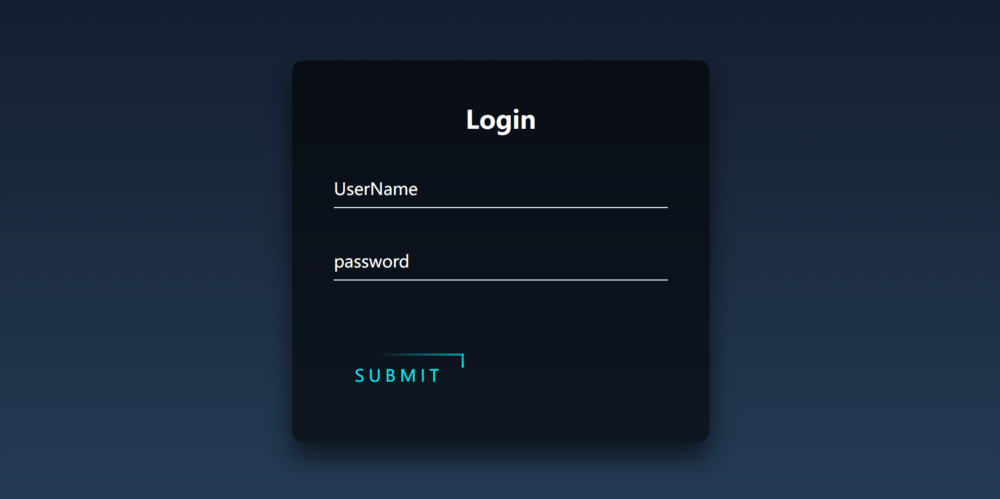
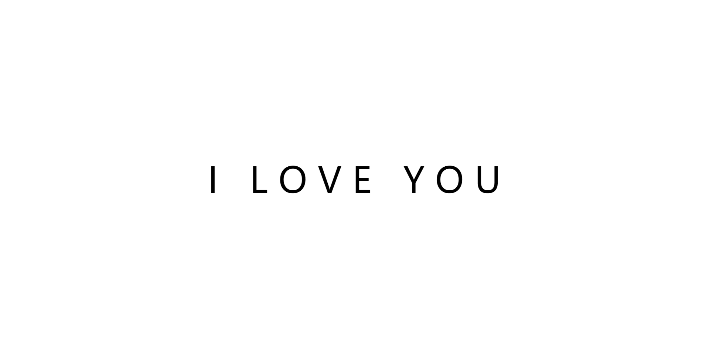
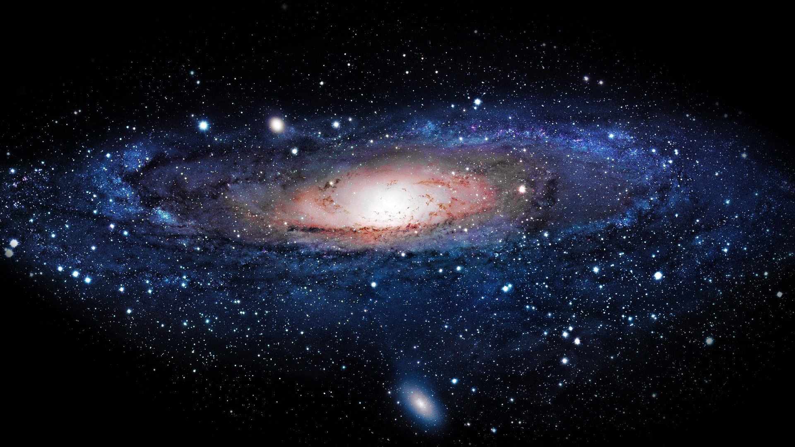
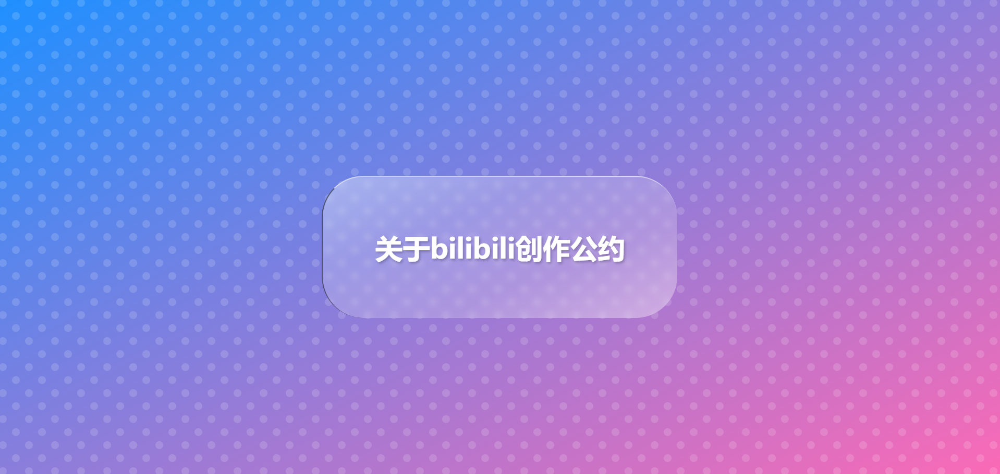
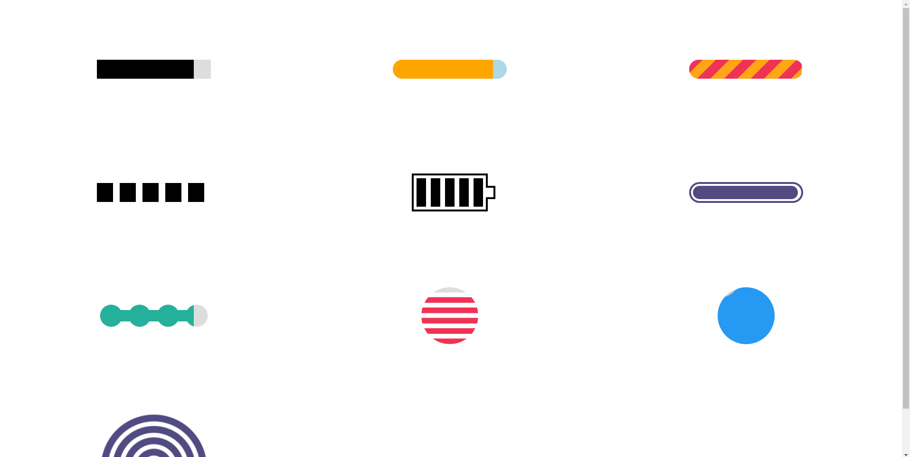
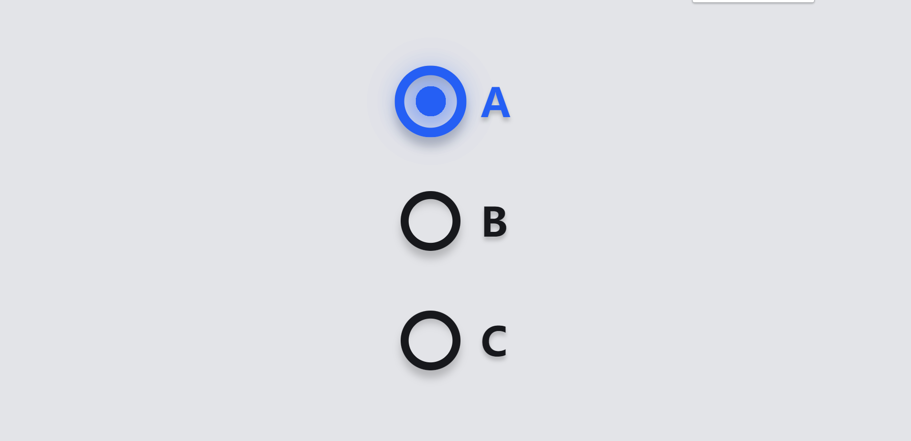

# HTML5+CSS3+JS案例集合

## 介绍
本项目介绍一些 HTML5+CSS3+JavaScript的小案例集合，欢迎大家交流讨论
## 目录
#### 001_一款清新的键盘，极具观赏价值

[代码地址](./code/001_一款清新的键盘，极具观赏价值/)  
[视频演示](https://www.bilibili.com/video/BV1oY41177gb/)

#### 002_漫天的雪花

[代码地址](./code/002_漫天的雪花/) 
[视频演示](https://www.bilibili.com/video/BV1d5411m7JN/)

#### 003_星辰大海、浩瀚宇宙离我们太遥远，不如从一个绕转的按钮开始吧

[代码地址](./code/003_星辰大海、浩瀚宇宙离我们太遥远，不如从一个绕转的按钮开始吧/) 
[视频演示](https://www.bilibili.com/video/BV1AY411E71o/)

#### 004_你见过很多的登录界面,但这一款最能让你砰然心动

[代码地址](./code/004_你见过很多的登录界面,但这一款最能让你砰然心动/) 
[视频演示](https://www.bilibili.com/video/BV1fa411e7Hk/)

#### 005_文字可能会消失，但爱会永存心中

[代码地址](./code/005_文字可能会消失，但爱会永存心中/) 
[视频演示](https://www.bilibili.com/video/BV1BY411j7WG/)

#### 006_浩瀚的星空,太酷了！几行代码轻松搞定,实现自己的一个星空梦。

[代码地址](./code/006_浩瀚的星空,太酷了！几行代码轻松搞定,实现自己的一个星空梦。/) 
[视频演示](https://www.bilibili.com/video/BV1tY4y1h7Cc/)

#### 007_一问一答效果,在开发种用上它,产品经理、设计师都会对我刮目相看

[代码地址](./code/007_一问一答效果,在开发种用上它,产品经理、设计师都会对我刮目相看/) 
[视频演示](https://www.bilibili.com/video/BV1R541127eE/)

#### 008_10种不同类型的进度条（收藏了，总有一天用得上）

[代码地址](./code/008_10种不同类型的进度条（收藏了，总有一天用得上）/) 
[视频演示](https://www.bilibili.com/video/BV1bF411M7Q9/)

#### 009_种上一棵平安树,愿疫情早日散去

[代码地址](./code/009_种上一棵平安树,愿疫情早日散去/) 
[视频演示](https://www.bilibili.com/video/BV1p34y1e7LF/)

#### 010_别具一格的单选框。骚气！

[代码地址](./code/010_别具一格的单选框。骚气！/) 
[视频演示]()